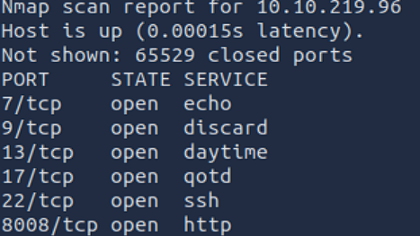
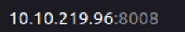
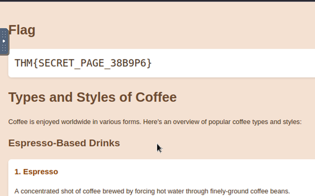
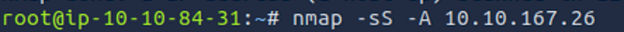

# Section 1 

Nmap uses multiple ways to specify the scope of it's targets.
It uses '-' to find the IP range e.g. 192.168.0.1-10, and '/' to find the subnet range e.g. 192.168.0.1/24 and you can also specify the target by it's hostname.

Nmap has the '-sn' option which stands for ping scan but this isn't limited as the conventional ping command.

# To scan a local network using Nmap

Usually to scan a local network we use the arp-scan because it only works on local networks but nmap isn't limited to.
To scan a local network we use the following command **'nmap -sn ip address'** using this command it will also shoe us the MAC address of the device because it's a local device (Connected through ethernet or wifi). 

# To scan a remote network

To scan a remote network we use the same command for the Local network scan and this is also what makes using Nmap unique, its versatility and convenience.
To run a Remote scan we'd usually use the ping command but the ping command won't give information if the target's system has a firewall setup.

Nmap also offers a List scan option **'-sL'**. This scan only lists the targets to scan without scanning them.
For example **'nmap -sL 192.168.0.1/24'** will list the 256 targets that will be scanned. This option helps confirm the targets before running the actual scan.

# Question:What is the last IP address that will be scanned when your scan target is 192.168.0.1/27?

To find this command, I used the -sL to list the IP addresses and took out the last IP address as the answer.

 Command 
 Answer

**What I Learned**

1. -sn is more flexible than normal ping.
2. /27 subnet = 32 addresses (192.168.0.1 → 192.168.0.31).
3. -sL lets me preview targets before launching scans.
4. Local scans reveal MAC addresses, remote scans don’t.

# Section 2

Port Scanning: Who is listening.

-sT		TCP connect scan – complete three-way handshake

-sS		TCP SYN – only first step of the three-way 			handshake

-sU		UDP scan

-F		Fast mode – scans the 100 most common ports

-p[range]	Specifies a range of port numbers – -p- scans all 		the ports

# Question 1: How many TCP ports are open on the target system at 10.10.219.96?

I ran the **-p-** command to go through all the ports and list the most common ones

These were the retrieved ports that were open on the target site

# Question 2:Find the listening web server on 10.10.219.96 and access it with your browser. What is the flag that appears on its main page?

Using the IP address and the port number, I was able to access the website and retrieve the flag.
The reason I used port 8008 was that it was identified as an HTTP

# Difficulties faced

1.	Found it difficult to list the IP and port to find the website for the flag in Q2, so I resorted to the hints.
2.	Understanding the SYN scan, which doesn't complete the handshake and only looks at the ports.

# What I learned

1. Difference between TCP Connect (-sT) and SYN (-sS) scans.
2. How to scan all ports (-p-) and fast scans (-F).
3. How to identify and access services running on open ports.
4. Alternative tools/commands for port checks, e.g., telnet.
5. Importance of stealth vs full handshake in network scanning.

# Section 3

**Version Detection: Extract More Information**

**OS Detection**

To enable OS detection we run  **-O**

**Service and Version Detection**

To run service and version detection we use **-sV**

To run both OS detection and version and service detection we can use the **-A** option 

And to force the scan we use **-sS** to run a simple SYN only handshake in TCP protocol.

If a scan host is appearing to be down we can use the **-Pn** functionality.

1. -O	OS detection
2. -sV	Service and version detection
3. -A	OS detection, version detection, and other additions
4. -Pn	Scan hosts that appear to be down

# Question: What is the name and detected version of the web server running on 10.10.167.26?

To solve this question I used the -A functionality because I didn't know which functionalities exactly should I used so I used **-A** to combine both the **-O** and **-sV** and look for the answer line by line

and the answer was the HTTP packet.

# Difficulties faced

1.	Used both OS detection adn service and version detection and foun difficulty in the answer so I resorted to using **-A**

# What I learned

1.	How to use Nmap's functionality to find different target computer specifications.

# Section 4

Timing: How Fast is Fast

1.	-T<0-5>		Timing template – paranoid (0), sneaky (1), polite (2), normal (3), aggressive (4), and insane (5)

2. --min-parallelism <numprobes> and --max-parallelism <numprobes>		Minimum and maximum number of parallel probes

3. --min-rate <number> and --max-rate <number>		Minimum and maximum rate (packets/second)

4. --host-timeout		Maximum amount of time to wait for a target host

# Question: What is the non-numeric equivalent of -T4?

-T aggressive

# Section 5

Output: Controlling What You See

**Verbosity and Debugging**

By adding -v we enable verbosity in the command

and to increase the level of verbosity we can define the level in the command by entering the number we please. e.g. -vvv or -v4

To use debugging level output we use -d and the maximum level we can specify is -d9

**Saving Scan Report**

The following commands to output the scan report

-oN <filename> - Normal output
-oX <filename> - XML output
-oG <filename> - grep-able output (useful for grep and awk)
-oA <basename> - Output in all major formats

# Question: What option must you add to your nmap command to enable debugging?

-d

# In conclusion

Option	Explanation
-sL	List scan – list targets without scanning

Host Discovery	
-sn	Ping scan – host discovery only

Port Scanning	
-sT	TCP connect scan – complete three-way handshake
-sS	TCP SYN – only first step of the three-way handshake
-sU	UDP Scan
-F	Fast mode – scans the 100 most common ports
-p[range]	Specifies a range of port numbers – -p- scans all the ports
-Pn	Treat all hosts as online – scan hosts that appear to be down

Service Detection	
-O	OS detection
-sV	Service version detection
-A	OS detection, version detection, and other additions

Timing	
-T<0-5>	Timing template – paranoid (0), sneaky (1), polite (2), normal (3), aggressive (4), and insane (5)
--min-parallelism <numprobes> and --max-parallelism <numprobes>	Minimum and maximum number of parallel probes
--min-rate <number> and --max-rate <number>	Minimum and maximum rate (packets/second)
--host-timeout	Maximum amount of time to wait for a target host

Real-time output	
-v	Verbosity level – for example, -vv and -v4
-d	Debugging level – for example -d and -d9

Report	
-oN <filename>	Normal output
-oX <filename>	XML output
-oG <filename>	grep-able output
-oA <basename>	Output in all major formats
