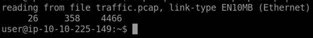
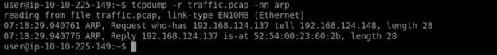
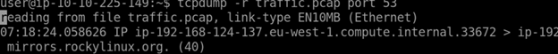
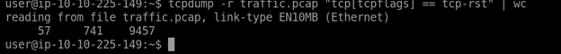
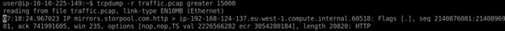
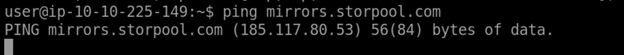
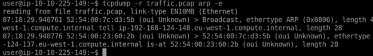

# Section 1

Basic Packet Capture

The following commands are an introductory to how to use tcpdump in filtering

tcpdump -i INTERFACE	Captures packets on a specific network interface
tcpdump -w FILE	Writes captured packets to a file
tcpdump -r FILE	Reads captured packets from a file
tcpdump -c COUNT	Captures a particular number of packets
tcpdump -n	Don’t resolve IP addresses
tcpdump -nn	Don’t resolve IP addresses and don’t resolve protocol numbers
tcpdump -v	Verbose display; verbosity can be increased with -vv and -vvv

# Section 2

Filtering Expressions

There are multiple ways to filter using 'tcpdump', those include Filtering by Host, filtering by Port, Filtering by Protocol, and we also have the capability of using logical operations to 
modify our filtering command further. Those include (and, or, not)

tcpdump host IP or tcpdump host HOSTNAME = Filters packets by IP address or hostname
tcpdump src host IP =	Filters packets by a specific source host
tcpdump dst host IP	= Filters packets by a specific destination host
tcpdump port PORT_NUMBER = Filters packets by port number
tcpdump src port PORT_NUMBER = Filters packets by the specified source port number
tcpdump dst port PORT_NUMBER = Filters packets by the specified destination port number
tcpdump PROTOCOL = Filters packets by protocol; examples include ip, ip6, and icmp

Above I found the number of packets in traffic.pcap using the icmp protocol using tcpdump 
-r is to read the file and wc is to summarize the word count

We used arp to find out who requested the ip address

Using the port number of DNS (53) we found the first subdomain to appear in the DNS query

# Section 3

Advanced Filtering

Filtering Basics: In real traffic captures (thousands/millions of packets), precise filters are essential.

Examples:
greater LENGTH → packets >= length
less LENGTH → packets <= length

Binary Operations (used in header filtering):

& (AND) → true if both bits = 1
| (OR) → true if at least one bit = 1
! (NOT) → inverts the bit

Header Byte Filtering:
  Syntax: proto[expr:size]
    proto: protocol (arp, ip, tcp, udp, etc.)
    expr: byte offset (0 = first byte)
    size: (1, 2, or 4 bytes, default = 1)

Examples:

ether[0] & 1 != 0 → packets sent to multicast address
ip[0] & 0xf != 5 → IP packets with options
TCP Flag Filtering (most practical use):
tcp[tcpflags] == tcp-syn → only SYN set
tcp[tcpflags] & tcp-syn != 0 → SYN flag present
tcp[tcpflags] & (tcp-syn|tcp-ack) != 0 → SYN or ACK present

Key takeaway: Advanced filters let you in on very specific traffic patterns (e.g., SYN scans, ACK floods, unusual headers) using binary operations on protocol header bytes.

using the tcp reset flag to find out the number of packets in traffic.pcap file that only have a reset flag

to find out the ip address of the command that requested more than 15,000 bytes we use the 'greater' filter

after getting the DNS of the host that requested 15,000 bytes we ping it to retrieve the ip address

# Section 4

Display Packets

-q → Quick/brief packet info
-e → Show MAC addresses (link-level header)
-A → Display packet data in ASCII
-xx → Show packets in hex
-X → Show packets in both hex + ASCII

using the arp command to find the mac address of the host that sent the arp request
